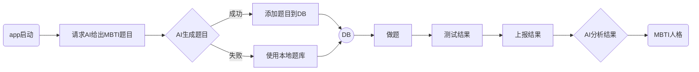

#  MBTITest

## update

**添加了api**

MBTI测试

接入Google GenerativeAI实现MBTI测试题的生成，与测试结果解析。本地实现MBTI人格测算的算法





## Detail

从AI获取题目：
```swift
    
    /// 获取新的MBTI题目
    func getNewQuestion() async -> String? {
        do {
            let prompt = """
随机生成一项MBTI测试题，格式如下：
 text: 你更倾向于按计划做事，还是随机应变？,options: [按计划做事, 随机应变],dimension: judgingPerceiving,scoreForOption: [1, -1] 
回答不要有任何多余的文字，且为json字符串
"""
            let response = try await generativeModel.generateContent(prompt)
           
            return response.text
            
        } catch {
            print(error.localizedDescription)
            return nil
        }
    }
```
计算结果：

``` swift

struct MBTIResult {
    let type: String
    let scores: [Dimension: Double]
    
}

    func calculate(answers: [Answer], questionBank: [Question]) -> MBTIResult {
        var scores: [Dimension: Double] = [.extraversionIntroversion: 0, .sensingIntuition: 0, .thinkingFeeling: 0, .judgingPerceiving: 0]
        
        for answer in answers {
            if  let question = questionBank.first(where: { question in
                question.id == answer.questionID
            }) {
                let selectedOptionIndex = answer.selectedOptionIndex
                let score = question.scoreForOption[selectedOptionIndex]
                scores[question.dimension]! += score
            }
        }
        
        // 简化版类型判断，实际应用中可以采用更复杂的算法
        let type = determineMBTIType(scores)
        
        return MBTIResult(type: type, scores: scores)
    }
    
    private func determineMBTIType(_ scores: [Dimension: Double]) -> String {
        var type = Array(repeating: "", count: 4)
        scores.forEach{ dimension, score in
            switch dimension {
            case .extraversionIntroversion:
                type.insert(score > 0 ? "E" : "I", at: 0)
            case .sensingIntuition:
                type.insert(score > 0 ? "S" : "N", at: 1)
            case .thinkingFeeling:
                type.insert(score > 0 ? "T" : "F", at: 2)
            case .judgingPerceiving :
                type.insert(score > 0 ? "J" : "P", at: 3)
            }
        }
        return type.joined()
    }
```

询问AI获取人格分析：

```swift
    ///  人格分析
    func sendMessage(_ MBTI: String) async  {
        do {
            let prompt = "使用中文解释MBTI性格中的" + MBTI + "字数150字"
            let response = try await generativeModel.generateContent(prompt)
            await MainActor.run {
                if let text = response.text {
                   self.reponseText = text
                }
            }
        } catch {
            print(error.localizedDescription)
        }
    }
```


## 效果

<video src="./Simulator%20Screen%20Recording%20-%20iPhone%2016%20Pro%20-%202024-10-14%20at%2017.30.01.mp4"></video>

https://github.com/LeiZiKang/MBTITest/blob/dev/Simulator%20Screen%20Recording%20-%20iPhone%2016%20Pro%20-%202024-10-14%20at%2017.30.01.mp4
